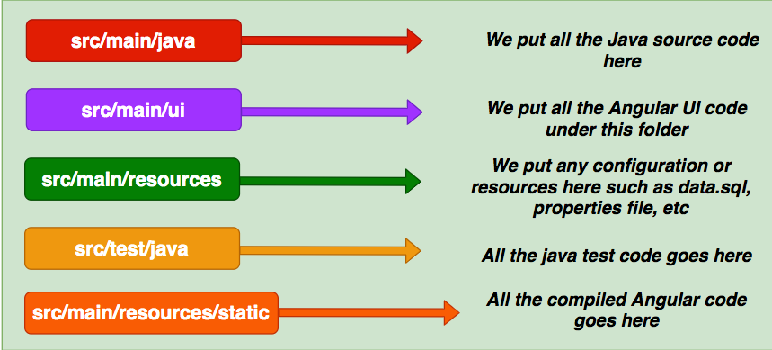

Angular: 9.1.13

In production run


Fo production phases all the compilation Angular code goes to the folder /src/main/resources/static
Whatever static assets you put under the static folder you can directly redirect from your Java Controller.
The correct outputPath is included in the angular.json workspace file. 

src/main/ui/package.json has 
```
    "build-prod": "ng build --prod --deploy-url /ui/",
```
and is called from frontend-maven-plugin.

Use frontend-maven-plugin which executes commands to place all the compiled source code int folder /src/main/ui/dist. 
The resources tag includes classpath resources associated with the project, so effectively copies src/main/ui/dist/ui to target/static/ui
The --deploy-url /ui/ means all static resources for this project are available under static/ui folder

This app forwards requests to / to /ui/index.html which includes app-root component.  The typescript class backing file then runs OnInit code to inivoke the service endpoint, the results of which are rendered in the app-root component html template. 
The app-root html template includes the app-user, whose component class inputs the Users list and binds the user fields in its html template.

Now, when the jar file is run, the Angular app is available from the Spring Boot embedded web server root context on the server port:
```aidl
http://localhost:8080
```
This is a good starting point to develop the UI more. 
